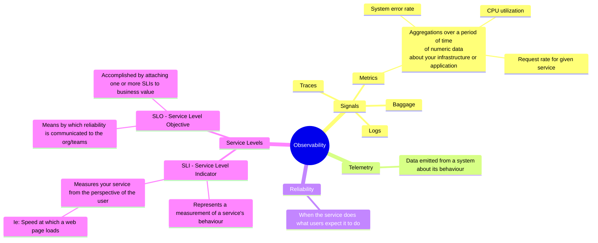

# Observability Notes

```mermaid
mindmap
  root((Observability))
    Signals
      Traces
      ::icon(fa fa-book)
      Metrics
        Aggregations over a period of time<br/>of numeric data<br/>about your infrastructure or application
          System error rate
          CPU utilization
          Request rate for given service
      Logs
      Baggage
    Telemetry
      Data emitted from a system<br/>about its behaviour
    Reliability
      When the service does what users expect it to do
    Service Levels
      SLI - Service Level Indicator
        Represents a measurement of a service's behaviour
        Measures your service from the perspective of the user
            Ie: Speed at which a web page loads
      SLO - Service Level Objective
        Means by which reliability is communicated to the org/teams
        Accomplished by attaching one or more SLIs to business value
```
