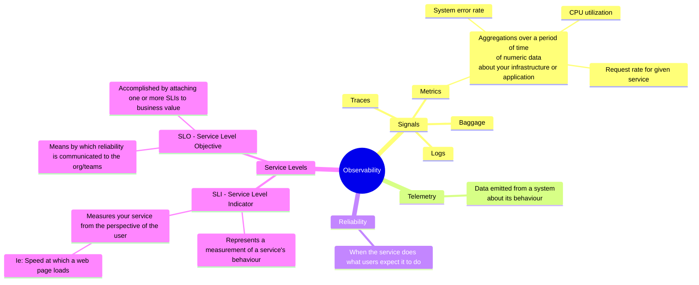

# Observability Notes

# Observability

Observability allows us to understand a system from the outside, enabling us to ask questions about it without needing to know its internal mechanics.  
It allows us to easily troubleshoot and addressing unfamiliar issues, often referred to as "unknown unknowns" and helps us answer the question, "Why is this happening?"

## Instrumentation

To ask questions about a system, `the application needs to be properly instrumented`.   
This means the code must emit `signals` such as `traces`, `metrics`, and `logs`. An application is well-instrumented when developers have all necessary information for 
troubleshooting without needing to add more instrumentation.

[OpenTelemetry](https://opentelemetry.io/docs/what-is-opentelemetry/) is an observability framework that instruments application code, facilitating the management of telemetry data throughout the entire stack. It gathers `traces`, `metrics`, and `logs` from across the system, enhancing its observability.

## Fundamentals

### [Performance Metrics Concepts](fundamentals/performance-metrics-concepts.md)
### [Prometheus](prometheus/README.md)

