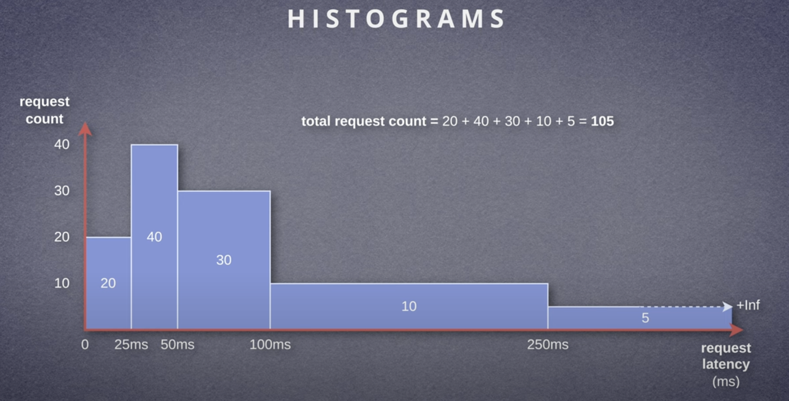

# Prometheus Metric Types

<!-- TOC depthFrom:2 -->
- [Gauges](#gauges)
- [Counters](#counters)
- [Summaries](#summaries)
- [Histograms](#histograms)
<!-- /TOC -->

<a name="gauges"></a>
## Gauges

<!-- TOC depthFrom:2 -->
- [Gauge Instrumentation Methods](#gauge-instrumentation-methods)
- [Gauge Exposition](#gauge-exposition)
- [Querying Gauges](#querying-gauges)
<!-- /TOC -->

A **Gauge** represents a single numerical value that **can arbitrarily go up and down**. Gauges are used to measure values that can fluctuate over time, such as:

- Current memory usage
- Queue length
- Disk space
- Temperature readings
- Number of active sessions

Gauges are ideal for metrics that need to track the current state or value of something, allowing for both increases and decreases.


### Gauge Instrumentation Methods

#### `set()`  
Sets the Gauge to any arbitrary value.
```java
queueLength.set(0);
```

#### `inc()` and `dec()`
Increment or decrement the gauge by 1 or a specified value.
```java
queueLength.inc(); // Increment by 1
queueLength.dec(); // Decrement by 1

queueLength.inc(42); // Increment by 42
queueLength.dec(12); // Decrement by 12
```

#### `setToCurrentTime()`
Sets the Gauge to the current time, useful for tracking events like boot time, process start time, or the last run of a job.
```java
aTimestamp.setToCurrentTime();
```

### Gauge Exposition

A Gauge will be displayed as a single time series like:

```promql
# HELP disk_free_bytes Usable space for path
# TYPE disk_free_bytes gauge
disk_free_bytes 1.0634604544E11
```

### Querying Gauges

#### Current Value
To get the current value of the `queue_length` gauge, use:
```promql
queue_length
```

#### Querying Over Time
To see how the value of the gauge has changed over the past 5 minutes, use:
```promql
queue_length[5m]
```

#### Applying Functions

To get the average value of the gauge over the past 5 minutes, use:
```promql
avg_over_time(queue_length[5m])
```

To determine how long ago an event occurred using a timestamp gauge, use:
```promql
time() - process_start_time_seconds
```

These queries help monitor and analyze gauge metrics effectively in Prometheus.

<a name="counters"></a>
## Counters

<!-- TOC depthFrom:2 -->
- [Counter Instrumentation Methods](#counter-instrumentation-methods)
- [Counter Exposition](#counter-exposition)
- [Querying Counters](#querying-counters)
<!-- /TOC -->

A **Counter** is a cumulative metric that represents a single **numerical value that only ever goes up**. It is used to measure values that only increase over time, such as:

- The number of requests served
- The number of errors encountered
- The number of tasks completed

Counters are ideal for metrics that **represent discrete events and are reset to zero only when the application restarts**. They are not suitable for values that can decrease, such as memory usage or the number of active sessions.


### Counter Instrumentation Methods

Counter metrics have only two methods to update their values:

#### `inc()`
Increments the counter by 1.
```java
totalRequests.inc(); // Increment by 1
```

#### `add()`
Increments the counter by an arbitrary value.
```java
totalRequests.add(23); // Increment by 23
```

These methods ensure that the counter only increases, making it ideal for tracking cumulative metrics such as the number of requests or errors.


### Counter Exposition

```promql
# HELP http_requests_total The total number of handled HTTP requests.
# TYPE http_requests_total counter
http_requests_total 666
```

When using counters, **focus on the rate at which the counter increases over time** rather than its absolute value.  
This helps determine trends such as the number of requests per second.

#### Counter Rate of Increase

- **`rate()`**: Calculates the per-second average rate of increase over a specified time window.
- **`irate()`**: Computes the per-second instantaneous rate of increase over the last two data points.
- **`increase()`**: Calculates the increase in the counter's value over a specified time window.

These functions are useful for analyzing the rate of change and identifying performance trends.

### Querying Counters

#### Current Value
Returns the current total count of HTTP requests.
```promql
http_requests_total
```

#### Calculate the rate of increase per second:
Calculates the per-second average rate of HTTP requests over the last 5 minutes.
```promql
rate(http_requests_total[5m])
```

#### Calculate the rate of increase per second, filtered by labels:
Calculates the per-second average rate of HTTP requests for the api-server job over the last 5 minutes.
```promql
rate(http_requests_total{job="api-server"}[5m])
```

#### Sum over all instances:
Sums the total count of HTTP requests across all instances.
```promql
sum(http_requests_total)
```

#### Sum rate over all instances:
Calculates the total rate of HTTP requests across all instances over the last 5 minutes.
```promql
sum(rate(http_requests_total[5m]))
```

#### Calculate the increase over a time period:
Calculates the increase in the count of HTTP requests over the last hour.
```promql
increase(http_requests_total[1h])
```

#### Monitor the total requests per endpoint:
Calculates the rate of HTTP requests per endpoint over the last 5 minutes.
```promql
sum by (handler) (rate(http_requests_total[5m]))
```

#### Top 5 endpoints with the highest request rate:
Returns the top 5 endpoints with the highest request rate over the last 5 minutes.
```promql
topk(5, sum by (handler) (rate(http_requests_total[5m])))
```

#### Top 5 endpoints with the highest request rate:
Returns the top 5 endpoints with the highest request rate over the last 5 minutes.
```promql
topk(5, sum by (handler) (rate(http_requests_total[5m])))
```

#### Request rate per instance with a graphical representation:
Show the request rate per instance for the `api-server` job over the last 5 minutes.
```promql
rate(http_requests_total{job="api-server"}[5m])
```


<a name="summaries"></a>
## Summaries

<!-- TOC depthFrom:2 -->
- [Summary Instrumentation Methods](#summary-instrumentation-methods)
- [Summary Exposition](#summary-exposition)
- [Querying Summaries](#querying-summaries)
<!-- /TOC -->

A **Summary** captures individual observations and provides a total count of observations and a sum of all observed values.  
Summaries can also calculate configurable quantiles over a sliding time window. **They are useful for measuring things like request durations or response sizes**.

#### Key Features:
- **Quantiles**: Calculates specific quantiles (e.g., 95th percentile) over a sliding time window.
- **Total Count**: Keeps a running count of observations.
- **Sum**: Keeps a running total of all observed values.

Summaries are suitable for tracking metrics where you need detailed statistical information about the distribution of the observed values.


### Summary Instrumentation Methods

#### `observeDuration()`
Tracking the latency of HTTP requests.

```java
Summary requestLatency = Summary.build()
        .name("http_request_latency_seconds")
        .help("Request latency in seconds.")
        .register();

Summary.Timer requestTimer = requestLatency.startTimer();

// simulate the request
simulateCall();

requestTimer.observeDuration();
```

### Summary Exposition

```promql
# HELP http_server_requests_seconds Duration of HTTP server request handling
# TYPE http_server_requests_seconds summary
http_server_requests_seconds{quantile="0.5"} 9.8304E-4
http_server_requests_seconds{quantile="0.85"} 0.001212416
http_server_requests_seconds{quantile="0.95"} 0.001212416
http_server_requests_seconds{quantile="0.99"} 0.001212416
http_server_requests_seconds_count 3020.0
http_server_requests_seconds_sum 4.124702425
```

The output of a Summary is a collection of Gauge and Counter metrics. However, it's important not to try averaging or aggregating percentiles from multiple service instances or other label dimensions, as there is no statistically valid way to average percentiles.

If you need to aggregate data, consider using a Histogram metric instead.


### Querying Summaries

#### Retrieve the count of observations:
Returns the total number of observed events (e.g., HTTP requests).
```promql
http_request_duration_seconds_count
```

#### Retrieve the sum of observed values:
Returns the sum of all observed durations.
```promql
http_request_duration_seconds_sum
```

#### Retrieve a specific quantile (e.g., the 95th percentile):
Returns the 95th percentile of the request durations.
```promql
http_request_duration_seconds{quantile="0.95"}
```

#### Filter by specific labels and retrieve the 95th percentile:
Filters the `http_request_duration_seconds` metric by `job`, `instance`, and `quantile` labels to get the `95th percentile` for a specific instance.
```promql
http_request_duration_seconds{job="api-server", instance="localhost:8000", quantile="0.95"}
```

#### Calculate the rate of count increase per second:
Calculates the per-second rate of increase in the count of HTTP requests over the last 5 minutes.
```promql
rate(http_request_duration_seconds_count[5m])
```

#### Sum of counts over all instances:
`Sums` the `total count` of HTTP requests across all instances.
```promql
sum(http_request_duration_seconds_count)
```

#### Sum of durations over all instances:
`Sums` the `total duration` of HTTP requests across all instances.
```promql
sum(http_request_duration_seconds_sum)
```

#### Request duration quantiles per endpoint:
Retrieves the `99th percentile` of request durations for each endpoint.
```promql
http_request_duration_seconds{quantile="0.99"} by (handler)
```

#### Average request duration per endpoint:
Calculates the average request duration per endpoint over the last 5 minutes.
```promql
 sum by (handler) (rate(http_request_duration_seconds_sum[5m])) 
/ 
 sum by (handler) (rate(http_request_duration_seconds_count[5m]))
```

#### Top 5 endpoints with the highest 95th percentile request duration:
Returns the top 5 endpoints with the highest 95th percentile request duration.
```promql
 topk(5, http_request_duration_seconds{quantile="0.95"} by (handler))
```

#### Total count of HTTP requests over the last hour:
Calculates the total count of HTTP requests over the last hour.
```promql
 increase(http_request_duration_seconds_count[1h])
```

#### Total sum of HTTP request durations over the last hour:
Calculates the total sum of HTTP request durations over the last hour.
```promql
 increase(http_request_duration_seconds_sum[1h])
```

#### Visualize the 99th percentile request duration over time for a specific job:
To `plot` the `99th percentile` request duration over time for the `api-server` job.
```promql
 http_request_duration_seconds{job="api-server", quantile="0.99"}
```


<a name="histograms"></a>
## Histograms

<!-- TOC depthFrom:2 -->
- [Histogram Instrumentation Methods](#histogram-instrumentation-methods)
- [Histogram Exposition](#histogram-exposition)
- [Querying Histograms](#querying-histograms)
<!-- /TOC -->

A **Histogram** samples observations and counts them in configurable buckets. It is useful for measuring the distribution of values, such as request durations or response sizes.

#### Key Features:
- **Buckets**: Predefined ranges that group observations.
- **Count**: Total number of observations.
- **Sum**: Sum of all observed values.
- **Quantiles**: Can approximate quantiles from bucket data.

Histograms are ideal for monitoring the distribution of events over time and understanding the range and frequency of observed values. They provide more detailed insight into the data compared to counters and gauges, especially for latency or size measurements.




### Histogram Instrumentation Methods

#### `observeDuration()`
Track the latency of HTTP requests.

```java
Histogram requestLatency = Histogram.build()
    .name("http_request_latency_seconds")
    .help("Request latency in seconds.")
    .register();

Histogram.Timer requestTimer = requestLatency.startTimer();

// simulate the request
simulateCall();

requestTimer.observeDuration();
```

### Histogram Exposition

```promql
# HELP lettuce_command_firstresponse_seconds Latency between command send and first response (first response received)
# TYPE lettuce_command_firstresponse_seconds histogram
lettuce_command_firstresponse_seconds_bucket{le="0.05"} 170741
lettuce_command_firstresponse_seconds_bucket{le="0.1"} 170757
lettuce_command_firstresponse_seconds_bucket{le="0.25"} 170890
lettuce_command_firstresponse_seconds_bucket{le="0.5"} 170961
lettuce_command_firstresponse_seconds_bucket{le="1"} 171019
lettuce_command_firstresponse_seconds_bucket{le="2.5"} 171061
lettuce_command_firstresponse_seconds_bucket{le="5"} 171109
lettuce_command_firstresponse_seconds_bucket{le="+Inf"} 201109
lettuce_command_firstresponse_seconds_count 171458
lettuce_command_firstresponse_seconds_sum 28.27548449
```

### Querying Histograms

#### Quantiles from Histograms

90th Percentile latency, averaged over the last 5 minutes:

```promql
histogram_quantile(
  0.9,
  rate(http_request_duration_seconds_bucket[5m])
)
```

#### Aggregated Histogram Quantiles
90th Percentile latency for each path/method combination, averaged over the last 5 minutes:

```promql
histogram_quantile(
  0.9,
  sum by (path, method, le) (
    rate(http_request_duration_seconds_bucket[5m])
  )
)
```

#### Average Latencies
Average request duration over the last 5 minutes:

```promql
rate(http_request_duration_seconds_sum[5m])
/
rate(http_request_duration_seconds_count[5m])
```

Aggregated per-path/method average request duration:

```promql
sum by (path, method) (rate(http_request_duration_seconds_sum[5m]))
/
sum by (path, method) (rate(http_request_duration_seconds_count[5m]))
```